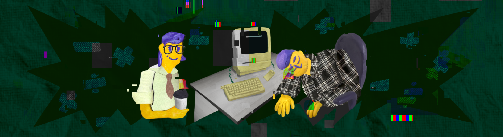

# SmartCalc v2.0

Implementation of SmartCalc v2.0.

The russian version of the task can be found in the repository.

## Contents

1. [Chapter I](#chapter-i) \
   1.1. [Introduction](#introduction)
2. [Chapter II](#chapter-ii) \
   2.1. [Information](#information)
3. [Chapter III](#chapter-iii) \
   3.1. [Part 1](#part-1-implementation-of-smartcalc-v20) \
   3.2. [Part 2](#part-2-bonus-credit-calculator) \
   3.3. [Part 3](#part-3-bonus-deposit-calculator)

## Chapter I

Planet Earth, 20 August 1983.

Chris has put a paper cup of coffee on the table beside you, and that wakes you up.

*"Pure black Americano, I hear you like it. It'll help you wake up."*

*"Oh yes, I really need it, thank you. Where were we?"* you asked as you sipped your hot coffee.

*"Have you finished the basic logic for the calculator?"*

*"Ah, it's still a work in progress. The meeting with Steve is tomorrow?"*

*"That's right. If we can show him some basic arithmetic operations with a refactored program structure, I think he'll like it.*

For more than a week now, you've been spending your evenings helping Chris Espinosa rewrite an object-oriented calculator. His latest version, using the standard structured approach, turned out not to be flexible and extensible enough for Steve Jobs, who was bursting with ideas. So you and Chris decided to try the emerging object-oriented programming paradigm in the young C++ language to solve these problems. Of course, learning new technologies caused some... difficulties, but there is hope that it will not be necessary to completely rewrite the calculator for the eighth time.

*"Well, let's speed things up."*

*"By the way, I met a developer from Norway the other day: Torkve or Trykve, I can't remember.* \
*Anyway, he told me about a scheme for organising data and application logic that allows us to change some components very flexibly and quickly. For example, we can completely separate the interface from the rest of the code, you know? And if Steve doesn't like something in the interface, it can be changed quickly and safely. We wouldn't even have to rewrite the tests for the rest of the logic."*

*"Sounds like exactly what we need! I'm all ears."*

## Introduction

In this project, you'll need to implement an extended version of the standard calculator in C++ using the object-oriented programming paradigm, implementing the same functions as the application previously developed in the SmartCalc v1.0 project. In addition to basic arithmetic operations such as add/subtract and multiply/divide, the calculator needs to be able to calculate arithmetic expressions by following the order, as well as some mathematical functions (sine, cosine, logarithm, etc.). Besides calculating expressions, it should also support the use of the variable _x_ and the graphing of the corresponding function. As for other improvements, you could consider a credit and deposit calculator.

## Chapter II

## Information

Note that you should use *Dijkstra's algorithm* to translate expressions into *reverse Polish notation* to implement the calculator. You can find all the necessary information in the SmartCalc v1.0 project description to refresh your knowledge.

### MVC pattern

The Model-View-Controller (MVC) pattern is a scheme for separating application modules into three macro components: a model that contains the business logic, a view that is a UI form for interacting with the program, and a controller that modifies the model by user action.

The concept of MVC was introduced in 1978 by Trygve Reenskaug, who was working on the Smalltalk programming language at Xerox PARC. Later, Steve Burbeck implemented the pattern in Smalltalk-80.
The final version of the MVC concept was published in Technology Object in 1988. The MVC pattern continued to evolve, giving rise to variants such as HMVC, MVA, MVVM.

The primary need for this pattern stems from developers' desire to separate the business logic of the program from the views, making it easier to replace views and reuse logic once implemented in other environments. Having a model separate from the view, and a controller to interact with it, allows you to reuse or modify code you have already written more efficiently.

The model stores and accesses the main data, performs operations on requests defined by the business logic of the program, i.e. it is responsible for the part of the program that handles all the algorithms and information processing. These models, modified by the controller, affect the display of information on the user interface. The model in this programme should be the class library that performs the calculations. This library must provide all the necessary classes and methods to perform them. And this is the business logic of the program, because it provides the means to solve the problem.

A controller is a thin macro component that performs model modifications. It is used to generate requests to the model. In code, it looks like a kind of "facade" for the model, that is, a set of methods that already work directly with the model. It is called thin because the ideal controller contains no additional logic other than calling one or more methods of the model. The controller acts as a link between the interface and the model. This allows the model to be completely encapsulated from the representation. This separation is helpful in that it allows the view code to know nothing about the model code and to address only the controller, whose interface of the provided functions is unlikely to change much. The model, on the other hand, can change significantly, and if you "move" to other algorithms, technologies, or even programming languages in the model, only a small piece of code in the controller directly related to the model needs to be changed. Otherwise, it would probably be necessary to rewrite a significant part of the interface code, as it would depend very much on the implementation of the model. So when the user interacts with the interface, they call controller methods that modify the model.

The view contains all the code associated with the programme interface. An ideal interface code should not contain any business logic. It just provides the form for interacting with the user.

## Chapter III

## Part 1. Implementation of SmartCalc v2.0

You need to implement the SmartCalc v2.0:

- The program must be developed in C++ language of C++17 standard;
- The program code must be located in the src folder;
- When writing code it is necessary to follow the Google style;
- Classes must be implemented within the `s21` namespace;
- Prepare full coverage of expression calculation modules with unit-tests using the GTest library;
- The program must be built with Makefile which contains standard set of targets for GNU-programs: all, install, uninstall, clean, dvi, dist, tests. Installation directory could be arbitrary;
- GUI implementation, based on any GUI library with API for C++17:
  * For Linux: GTK+, CEF, Qt, JUCE;
  * For Mac: GTK+, CEF, Qt, JUCE, SFML, Nanogui, Nngui;
- The program must be implemented using the MVC pattern, and also:
   - there should be no business logic code in the view code;
   - there should be no interface code in the controller and the model;
   - controllers must be thin;
- Both integers and real numbers with a dot can be input into the program. You should provide the input of numbers in exponential notation;
- The calculation must be done after you complete entering the calculating expression and press the `=` symbol;
- Calculating arbitrary bracketed arithmetic expressions in infix notation;
- Calculate arbitrary bracketed arithmetic expressions in infix notation with substitution of the value of the variable _x_ as a number;
- Plotting a graph of a function given by an expression in infix notation with the variable _x_ (with coordinate axes, mark of the used scale and an adaptive grid);
   - It is not necessary to provide the user with the ability to change the scale;
- Domain and codomain of a function are limited to at least numbers from -1000000 to 1000000;
   - To plot a graph of a function it is necessary to additionally specify the displayed domain and codomain;
- Verifiable accuracy of the fractional part is at least to 7 decimal places;
- Users must be able to enter up to 255 characters;
- Bracketed arithmetic expressions in infix notation must support the following arithmetic operations and mathematical functions:
   - **Arithmetic operators**:
     | Operator name | Infix notation   (Classic) | Prefix notation   (Polish notation) |  Postfix notation   (Reverse Polish notation) |
      | --------- | ------ | ------ | ------ |
      | Brackets | (a + b) | (+ a b) | a b + |
      | Addition | a + b | + a b | a b + |
      | Subtraction | a - b | - a b | a b - |
      | Multiplication | a * b | * a b | a b * |
      | Division | a / b | / a b | a b \ |
      | Power | a ^ b | ^ a b | a b ^ |
      | Modulus | a mod b | mod a b | a b mod |
      | Unary plus | +a | +a | a+ |
      | Unary minus | -a | -a | a- |
      >Note that the multiplication operator contains the obligatory sign `*`. Processing an expression with the omitted `*` sign is optional and is left to the developer's decision.
   - **Functions**:
      | Function description | Function |
      | ------ | ------ |
      | Computes cosine | cos(x) |
      | Computes sine | sin(x) |
      | Computes tangent | tan(x) |
      | Computes arc cosine | acos(x) |
      | Computes arc sine | asin(x) |
      | Computes arc tangent | atan(x) |
      | Computes square root | sqrt(x) |
      | Computes natural logarithm | ln(x) |
      | Computes common logarithm | log(x) |

## Part 2. Bonus. Credit calculator

Provide a special mode "credit calculator" (you can take banki.ru and calcus.ru as an example):
- Input: total credit amount, term, interest rate, type (annuity, differentiated);
- Output: monthly payment, overpayment on credit, total payment.

## Part 3. Bonus. Deposit calculator

Provide a special mode "deposit profitability calculator" (you can take banki.ru and calcus.ru as an example):
- Input: deposit amount, deposit term, interest rate, tax rate, periodicity of payments, capitalization of interest, replenishments list, partial withdrawals list;
- Output: accrued interest, tax amount, deposit amount by the end of the term.

💡 [Tap here](https://forms.yandex.ru/cloud/64181abec769f101d44293de/) **to leave your feedback on the project**. Product Team really tries to make your educational experience better.
